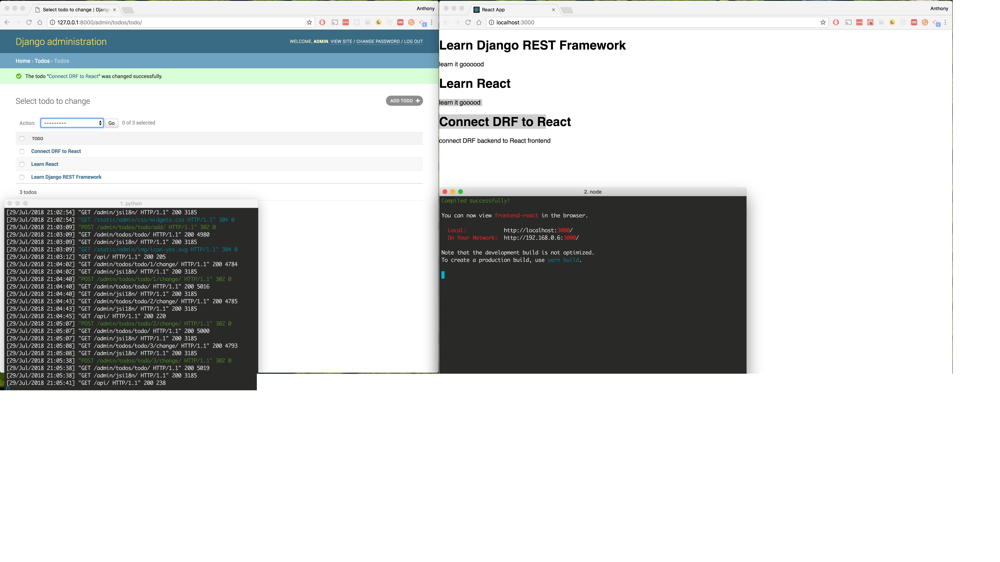

## Django REST Framework backend + React frontend 

` activate virtual environment (if it's already in your path) - cd backend-django && venv/bin/activate  ` 

` Django - cd backend-django && pip install django djangorestframework django-cors-headers && python manage.py createsuperuser &&  python manage.py runserver `

` React - cd frontend-react && npm install && npm start `

` Django - go to http://127.0.0.1:8000/admin/ & enter superuser credentials `

` React - go to http://localhost:3000/ & API entries will be displayed `

# https://wsvincent.com/django-rest-framework-react-tutorial/
